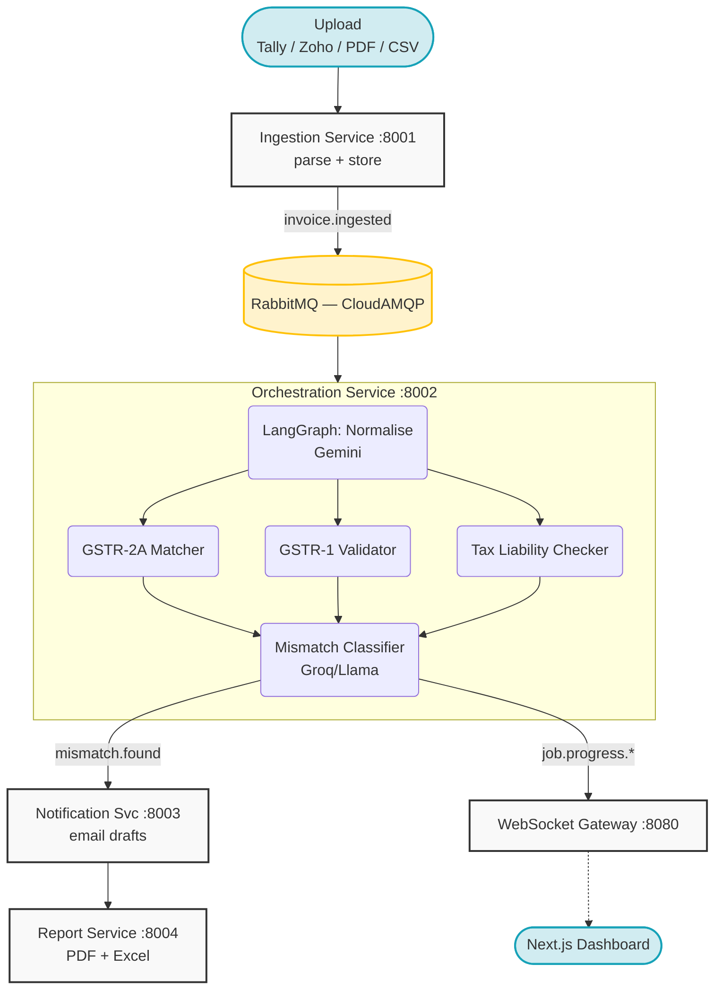

<div align="center">
  <h1>GST Reconciliation Agent</h1>
  <p><strong>AI-powered GST reconciliation system for Indian CAs and finance teams.</strong></p>
  <p>Reduces 6–10 hours of manual GSTR-2A vs purchase register reconciliation to under 5 minutes.</p>

  <p>
    
    
    
    
    
  </p>
</div>

---

## Architecture



---

## Tech Stack & Infra

> **100% free-tier infra** — ₹0/month up to 300 jobs.

| Layer | Technology | Cost (Free Tier) |
|-------|-----------|------|
| **Agent orchestration** | LangGraph | Free |
| **AI — parsing** | Gemini 1.5 Flash | Free (15 req/min) |
| **AI — classification** | Groq / Llama 3.3 70B | Free (14,400 req/day) |
| **Services** | FastAPI (Python 3.11) | Free |
| **Message broker** | RabbitMQ (CloudAMQP) | Free (1M msg/month) |
| **Real-time** | WebSockets | Free |
| **Database** | PostgreSQL + pgvector (Supabase) | Free |
| **File storage** | GCP Cloud Storage | Free (5GB) |
| **Compute** | GCP Cloud Run | Free (2M req/month) |
| **Frontend** | Next.js (Vercel) | Free |
| **CI/CD** | GitHub Actions | Free |
| **Observability** | OpenTelemetry + Grafana Cloud | Free |
| **Total** | | **₹0/month** |

---

## Project Structure

```
gst-reconciliation-agent/
├── shared/                    # Shared models, DB, publisher, tracing
├── migrations/                # SQL schema migrations
├── scripts/                   # Init DB, seed data, utilities
├── ingestion_service/         # Phase 2 — file upload & parsing
├── orchestration_service/     # Phase 3 — LangGraph agent pipeline
├── notification_service/      # Phase 4 — email drafts & approval
├── report_service/            # Phase 4 — PDF/Excel report generation
├── gateway/                   # Phase 5 — WebSocket real-time gateway
├── frontend/                  # Phase 5 — Next.js CA dashboard
├── .github/workflows/         # Phase 6 — CI/CD per service
├── docker-compose.yml         # Local dev: Postgres + RabbitMQ
├── .env.example               # Environment variable blueprint
└── README.md
```

---

## Quick Start (Local Dev)

### Prerequisites
- Python 3.11
- Docker Desktop
- Node.js 18+

### 1. Clone & setup
```bash
git clone https://github.com/your-username/gst-reconciliation-agent
cd gst-reconciliation-agent
```

### 2. Environment variables
```bash
cp .env.example .env
# Fill in your API keys (see .env.example for instructions)
```

### 3. Activate venv & install dependencies
```bash
# Windows
.venv\Scripts\activate

# Install service dependencies
pip install -r shared/requirements.txt
pip install -r ingestion_service/requirements.txt
pip install -r orchestration_service/requirements.txt
```

### 4. Start local infrastructure (Postgres + RabbitMQ)
```bash
docker-compose up -d postgres rabbitmq
```

### 5. Run DB migrations
```bash
python scripts/init_db.py
```

### 6. Start services (separate terminals)
```bash
# Terminal 1 — Ingestion Service
uvicorn ingestion_service.main:app --port 8001 --reload

# Terminal 2 — Orchestration Service
uvicorn orchestration_service.main:app --port 8002 --reload

# Terminal 3 — Notification Service
uvicorn notification_service.main:app --port 8003 --reload

# Terminal 4 — Report Service
uvicorn report_service.main:app --port 8004 --reload

# Terminal 5 — WebSocket Gateway
uvicorn gateway.main:app --port 8080 --reload
```

### 7. Start frontend
```bash
cd frontend
npm install
npm run dev    # → http://localhost:3000
```

---

## API Keys You Need

| Key | Where to get | Time |
|-----|-------------|------|
| `GEMINI_API_KEY` | [Google AI Studio](https://aistudio.google.com/apikey) | 1 min |
| `GROQ_API_KEY` | [Groq Console](https://console.groq.com/keys) | 1 min |
| `RABBITMQ_URL` | [CloudAMQP](https://www.cloudamqp.com/) → Little Lemur | 2 min |
| `SUPABASE_SERVICE_ROLE_KEY` | Supabase Dashboard → Settings → API | 1 min |
| `GCP_PROJECT_ID` | [Google Cloud Console](https://console.cloud.google.com/) | 5 min |

> **Note:** GCP credentials only needed from Phase 6+. Everything before that works without GCP.
