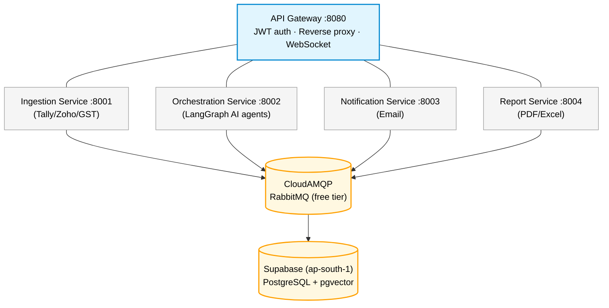
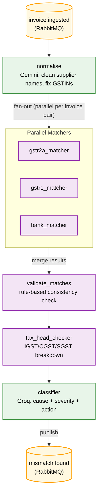

<div align="center">
  <h1>GST Reconciliation Agent</h1>
  <p><strong>An AI-powered GST reconciliation system for Chartered Accountants.</strong></p>
  <p>Automatically matches invoices between Tally/Zoho Books and the GST Portal (GSTR-2A/3B), classifies mismatches by severity, sends supplier follow-up emails, and generates PDF/Excel reports — all driven by a LangGraph multi-agent pipeline.</p>
  
  <p>
    
    
    
    
    
  </p>
</div>

---

## Architecture



**LLM Providers (free tier):**
- Gemini 1.5 Flash — invoice normalisation (15 RPM)
- Groq Llama-3 — mismatch classification (30 RPM)
- Circuit breaker + token bucket rate limiter across both

---

## Tech Stack

| Layer | Technology |
|-------|-----------|
| Language | Python 3.11 |
| Web framework | FastAPI |
| AI pipeline | LangGraph (StateGraph) |
| LLMs | Gemini 1.5 Flash, Groq Llama-3.3-70B |
| Database | Supabase (PostgreSQL 15 + pgvector) |
| Message broker | CloudAMQP (RabbitMQ, Little Lemur free tier) |
| Email | Gmail SMTP / SendGrid |
| PDF | ReportLab |
| Excel | openpyxl |
| Auth | Supabase Auth (JWT HS256) |
| Containers | Docker + Docker Compose |

---

## Getting Started

### Prerequisites

- Python 3.11+
- Git
- A free [Supabase](https://supabase.com) account
- A free [CloudAMQP](https://cloudamqp.com) account (Little Lemur plan)
- A [Gemini API key](https://aistudio.google.com) (free)
- A [Groq API key](https://console.groq.com) (free)

### 1. Clone & Set Up

```bash
git clone https://github.com/your-username/gst-reconciliation-agent
cd gst-reconciliation-agent

python -m venv .venv
.venv\Scripts\activate          # Windows
# source .venv/bin/activate     # Linux/Mac
```

### 2. Install Dependencies

```bash
pip install -r shared/requirements.txt
pip install -r ingestion_service/requirements.txt
pip install -r orchestration_service/requirements.txt
pip install -r notification_service/requirements.txt
pip install -r report_service/requirements.txt
pip install -r gateway_service/requirements.txt
```

### 3. Configure Environment

Copy `.env` (already present) and fill in your credentials.

| Key | Where to get it |
|-----|----------------|
| `DATABASE_URL` | Supabase → Settings → Database → Connection string |
| `SUPABASE_URL` | Supabase → Settings → API |
| `SUPABASE_ANON_KEY` | Supabase → Settings → API |
| `SUPABASE_SERVICE_ROLE_KEY` | Supabase → Settings → API |
| `SUPABASE_JWT_SECRET` | Supabase → Settings → API → JWT Secret |
| `RABBITMQ_URL` | CloudAMQP → Instance → AMQP URL |
| `GEMINI_API_KEY` | [aistudio.google.com](https://aistudio.google.com) |
| `GROQ_API_KEY` | [console.groq.com](https://console.groq.com) |
| `SMTP_USERNAME` | Your Gmail address |
| `SMTP_PASSWORD` | Gmail → App Passwords (16-char) |

Validate your configuration:
```bash
python scripts/validate_env.py
```

### 4. Run Tests

```bash
python -m pytest ingestion_service/tests/ orchestration_service/tests/ notification_service/tests/ report_service/tests/ gateway_service/tests/ -v
```

Expected: **73+ tests passing**

### 5. Start Services (Development)

**Windows (PowerShell):**
```powershell
.\scripts\start_dev.ps1
```

**Linux/Mac (or Windows with Make):**
```bash
make start
```

**Service URLs:**
| Service | URL |
|---------|-----|
| Gateway (main entry) | http://localhost:8080 |
| Gateway health | http://localhost:8080/health |
| All services status | http://localhost:8080/services |
| Ingestion docs | http://localhost:8001/docs |
| Orchestration docs | http://localhost:8002/docs |
| Notification docs | http://localhost:8003/docs |
| Report docs | http://localhost:8004/docs |

---

## Project Structure

```
GST Reconciliation Agent/
├── shared/                    ← Models, config, DB, publisher
│   ├── config.py              ← Pydantic settings (all .env vars)
│   ├── db.py                  ← SQLAlchemy async engine
│   ├── models.py              ← ORM + Pydantic schemas
│   ├── publisher.py           ← RabbitMQ publish helper
│   └── tracing.py             ← OpenTelemetry setup
│
├── ingestion_service/         ← Port 8001
│   ├── ingestors/             ← Tally XML, Zoho CSV, GST Portal
│   ├── normaliser.py          ← Gemini-powered field normalisation
│   └── main.py
│
├── orchestration_service/     ← Port 8002
│   ├── graph.py               ← LangGraph StateGraph pipeline
│   ├── llm_gateway.py         ← Circuit breaker + rate limiter
│   ├── agents/                ← normalise, match, validate, tax, classify
│   └── consumer.py            ← RabbitMQ → LangGraph trigger
│
├── notification_service/      ← Port 8003
│   ├── email_builder.py       ← Jinja2 email templates
│   ├── sender.py              ← SMTP / SendGrid backend
│   └── consumer.py            ← mismatch.found → email
│
├── report_service/            ← Port 8004
│   ├── pdf_builder.py         ← ReportLab PDF (cover + tables)
│   ├── excel_builder.py       ← openpyxl Excel (4 sheets)
│   └── consumer.py            ← reconciliation_done → PDF + Excel
│
├── gateway_service/           ← Port 8080
│   ├── auth.py                ← Supabase JWT validation
│   ├── websocket_manager.py   ← WebSocket connection registry
│   ├── consumer.py            ← RabbitMQ → WebSocket bridge
│   └── proxy.py               ← httpx reverse proxy
│
├── docs/                      ← Phase documentation (gitignored)
├── scripts/
│   ├── validate_env.py        ← Pre-flight .env checker
│   └── start_dev.ps1          ← Windows dev launcher
├── docker-compose.yml
├── Makefile
└── .env                       ← Your secrets (gitignored)
```

---

## LangGraph Pipeline



**Rate limiting:**
- Gemini: 15 RPM via `TokenBucketRateLimiter`
- Groq: 30 RPM via `TokenBucketRateLimiter`
- `CircuitBreaker`: trips after 3 failures, resets after 30s

---

## Real-Time Progress (WebSocket)

```javascript
const ws = new WebSocket(
  `ws://localhost:8080/ws/jobs/${jobId}?token=${supabaseToken}`
);

ws.onmessage = (event) => {
  const msg = JSON.parse(event.data);
  if (msg.type === "progress") updateProgressBar(msg.progress_pct);
  if (msg.type === "report_ready") showDownloadButton(msg.pdf_path);
};

setInterval(() => ws.send("ping"), 30000);  // keep-alive
```

---

## API Reference

All requests go through the Gateway at `http://localhost:8080`.
Include `Authorization: Bearer <supabase-jwt>` on all `/api/*` routes.

| Method | Path | Description |
|--------|------|-------------|
| `GET` | `/health` | Gateway health |
| `GET` | `/services` | All service health check |
| `WS` | `/ws/jobs/{id}` | Real-time progress stream |
| `POST` | `/api/ingestion/upload` | Upload Tally/Zoho/GST files |
| `GET` | `/api/orchestration/jobs/{id}` | Job status |
| `GET` | `/api/reports/jobs/{id}/report/pdf` | Download PDF report |
| `GET` | `/api/reports/jobs/{id}/report/excel` | Download Excel report |
| `POST` | `/api/notifications/test-email` | Send test email |

---

## License

MIT
